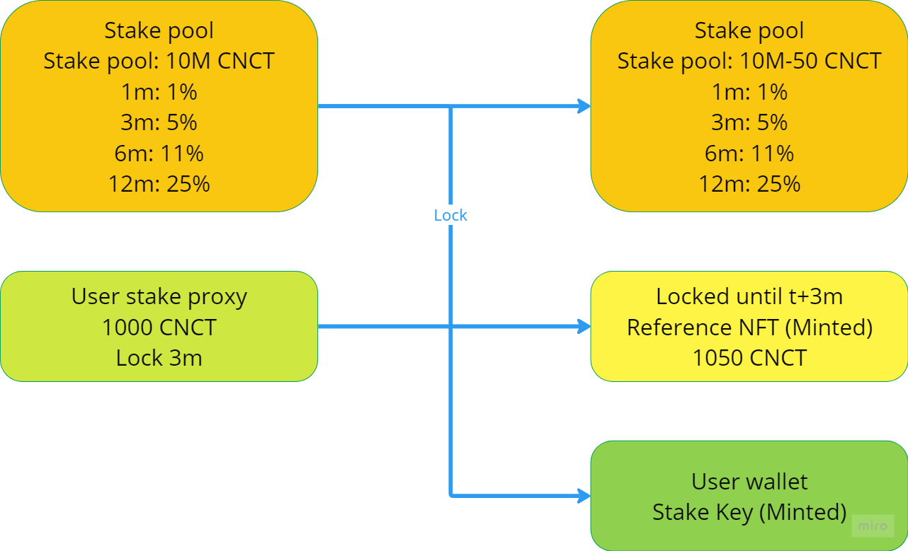

# staking-contracts

The Coinecta staking contracts support the requirement of being able to allow
users to lock tokens for certain time periods and get a percentage reward for
it. Because these locking periods can potentially be long we bind the time lock
to a unique CIP-68 NFT (the stake key) minted during the locking transaction.
This allows the user to move to another wallet (for example due to loss of seed
phrase of the original wallet) or even sell the stake key to someone else on a
secondary market such as jpg.store.


## Main requirements

These are the main requirements the contracts need to fulfil:

- Guarding the assets in the stake pool to only be used as rewards for staking
- Protect the user and ensure the staking reward and time period match their
  expectation
- Mint unique stake key to the user
- Rewards are part of the lock from the beginning.

## Validators

### stake_pool

This validator ensures that the assets within the utxo are only spent by a
locking transaction or by the owner of the stake pool. Part of it's datum is a
list of RewardSettings, each containing a valid locking period in days and the
percentage reward that follows with it. The owner can choose to remove the
assets from the stake pool or change the reward settings at any time.

Main validations to be done in a locking transaction:

- A new utxo is made with the same datum and validator attached.
- The reward matches the percentage in the chosen reward setting.
- The assets are unchanged other than the reward that is moved to the time lock
  utxo
- The time lock is locked according to the chosen reward setting.

### stake_proxy

This validator protects the assets that the user wants to lock. Because the
stake_pool is a singleton interacting with it directly could give issues during
busy periods. So the user defines their staking order in a stake_proxy utxo
after which automated off chain code can ensure the order is fulfilled. If for
whatever reason the order is not fulfilled the utxo can be refunded in a
transaction signed by the user.

Main validations to be done in a locking transaction:

- The reward is matching user expectation
- The locking period is matching user expectation
- The stake key is minted to the user using expected policy

### time_lock

This is a fairly simple time lock, making sure it can not be spend before a
certain time. Once the time is reached it can be spend as long as the stake key
is burned in the same transaction.

Main validations to be done in unstake transaction:

- The transaction is executed after the unlock time has been reached.
- The stake key is burned in the transaction.

## Minting policies

### stake_key_mint

This minting policy checks which assets are locked and when they unlock. On top
of that it ensures the asset name is unique and that a reference nft is minted
into the timelock to support CIP 68

The on chain asset name will be the first 28 bytes of a blake2b_256 hash of the
output reference of the stake pool input. We store CIP-68 metadata in the time
lock to allow for a good representation in wallets etc. The metadata is also
checked to ensure it matches what is being locked.

Main validations during a mint:

- Asset name follows the expected template
- Only 1 stake key and 1 corresponding reference NFT is minted

## Transactions

### Create stake proxy

| inputs      | mints | outputs     |
| ----------- | ----- | ----------- |
| user wallet |       | stake_proxy |


### Create Stake Pool

| inputs       | mints | outputs    |
| ------------ | ----- | ---------- |
| owner wallet |       | stake_pool |


### Lock stake

| inputs      | mints            | outputs                     |
| ----------- | ---------------- | --------------------------- |
| stake_pool  |                  | stake_pool                  |
| stake_proxy | reference nft +1 | time_lock                   |
|             | stake_key + 1    | user wallet                 |
|             |                  | Off chain operator (change) |



### Unstake

1 time lock input is shown here, but a user can unstake multiple time locks in 1
transaction assuming they all are passed their unlock time.

| inputs      | mints             | outputs     |
| ----------- | ----------------- | ----------- |
| time_lock   | reference nft - 1 | user wallet |
| user wallet | stake_key - 1     |             |


## Building

Update the build.sh script with the CBOR serialised policy id + asset id of the
batcher certificate.

```sh
./build.sh
```

## Testing

You can write tests in any module using the `test` keyword. For example:

```gleam
test foo() {
  1 + 1 == 2
}
```

To run all tests, simply do:

```sh
aiken check
```

To run only tests matching the string `foo`, do:

```sh
aiken check -m foo
```

## Documentation

If you're writing a library, you might want to generate an HTML documentation
for it.

Use:

```sh
aiken docs
```

## Resources

Find more on the [Aiken's user manual](https://aiken-lang.org).
